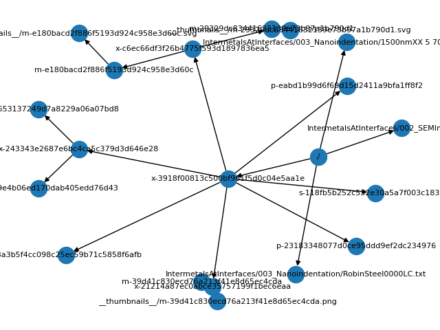

## PASTA ELN
Its home is at: https://github.com/PASTA-ELN

Here is a graph view of the example


### PASTA.eln
```yml
- ro-crate-metadata.json
    - publisher: PASTA ELN
    - version: 1.0
- ./
    - x-3918f00813c500bf961f5d0c04e5aa1e,  items: 13 
        - x-8a3b5f4cc098c25ec59b71c5858f6afb,  items: 10 
        - x-243343e2687e6bc4ca5c379d3d646e28,  items: 11 
            - x-59ce85c9e4b06ed170dab405edd76d43,  items: 11 
            - x-a4bc8ea653137249d7a8229a06a07bd8,  items: 10 
        - x-21214a87ec0abce35757199f1bec6eaa,  items: 11 
            - m-39d41c830ecd76a213f41e8d65ec4cda,  items: 14 
                - __thumbnails__/m-39d41c830ecd76a213f41e8d65ec4cda.png,  items: 1 
        - x-c6ec66df3f26b4775f593d1897836ea5,  items: 11 
            - m-29329dc83441632139e73b97a1b790d1,  items: 14 
                - __thumbnails__/m-29329dc83441632139e73b97a1b790d1.svg,  items: 1 
            - m-e180bacd2f886f5193d924c958e3d60c,  items: 14 
                - __thumbnails__/m-e180bacd2f886f5193d924c958e3d60c.svg,  items: 1 
        - p-23183348077d0ce95ddd9ef2dc234976,  items: 14 
        - p-eabd1b99d6f69d15d2411a9bfa1ff8f2,  items: 14 
        - s-118fb5b252c532e30a5a7f003c183e2f,  items: 12 
    - IntermetalsAtInterfaces/002_SEMImages/Zeiss.tif,  items: 1 
    - IntermetalsAtInterfaces/003_Nanoindentation/RobinSteel0000LC.txt,  items: 1 
    - IntermetalsAtInterfaces/003_Nanoindentation/1500nmXX 5 7074 -4594.txt,  items: 1 

```
