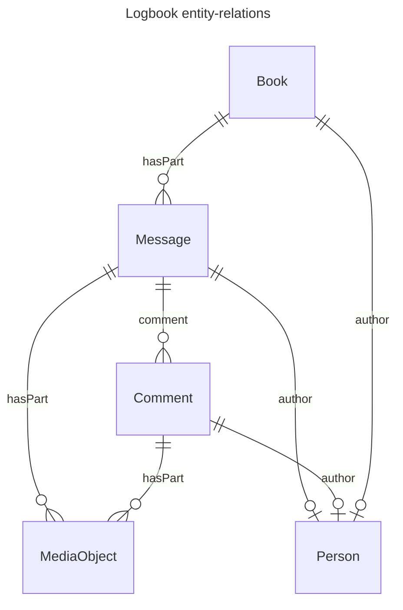

# SciLog ELN

[Homepage](https://www.psi.ch/en/awi/scilog) | [Docs](https://paulscherrerinstitute.github.io/scilog/) | [Code](https://github.com/paulscherrerinstitute/scilog)

SciLog allows users to export logbooks in the [ELN File format](https://github.com/TheELNConsortium/TheELNFileFormat/blob/master/SPECIFICATION.md) (support for ELN import is work-in-progress). 
While the overall implementation is similar to other ELN implementations (e.g. the ELN is a zipped RO-Crate with .eln extension), it has the following pecularities
- Instead of using the `genre` property (e.g. like elabFTW) to distinguish between ELN concepts, SciLog uses more specific scehma.org types in addition to `Dataset` (e.g. Book, Message, etc), 
- Hence, entities may have multiple `@type`s e.g. `[Book, Dataset]`

Below, we describe the entities in SciLog, their relationships, how they are represented in ELN format, and an example .eln export.

## Structure of a logbook

A logbook is a collection of messages. A message may have several comments. Both messages and comments may have attached files.
We found the following schema.org types appropriate for these entities:

| ELN Concept | schema.org class                              |
| ----------- | --------------------------------------------- |
| Logbook     | [Book](https://schema.org/Book)               |
| Message     | [Message](https://schema.org/Message)         |
| Comment     | [Comment](https://schema.org/Comment)         |
| File        | [MediaObject](https://schema.org/MediaObject) |

We note that all the above types inherit from CreativeWork.

### How are the entities related?

- A Logbook (`Book`) has  `Message`s through the [`hasPart`](https://schema.org/hasPart) property.
- A `Message` has `Comment`s through the [`comment`](https://schema.org/comment) property.
- Messages and Comments have files (i.e. `MediaObject`s) through the [`hasPart`](https://schema.org/messageAttachment) property. 
(`MediaObject` is aliased to `File` in the [ro-crate context](https://w3id.org/ro/crate/1.2/context))

Visually:



### Properties of the entities

The Logbook is our container type. It has a title, author / creator, description, and create/update timestamps.
We map these to following schema.org properties:

| Logbook property | schema.org property                             |
| ---------------- | ----------------------------------------------- |
| created at       | [dateCreated](https://schema.org/dateCreated)   |
| updated at       | [dateModified](https://schema.org/dateModified) |
| title            | [name](https://schema.org/name)                 |
| description      | [description](https://schema.org/description)   |
| creator/author   | [author](https://schema.org/author)             |

A message and comment have the same properties:

| Message / Comment property | schema.org property                                                |
| -------------------------- | ------------------------------------------------------------------ |
| created at                 | [dateCreated](https://schema.org/dateCreated)                      |
| updated at                 | [dateModified](https://schema.org/dateModified)                    |
| HTML text content          | [text](https://schema.org/text)                                    |
|                            | [`encodingFormat`](https://schema.org/encodingFormat): `text/html` |
| tags                       | [keywords](https://schema.org/keywords)                              |
| author                     | [author](https://schema.org/author)                                |

An `author` is a schema.org `Person`.

Finally, a File may have the usual [metadata properties](https://github.com/TheELNConsortium/TheELNFileFormat/blob/master/SPECIFICATION.md#example-file) as described in the ELN file format.

### How are attached files included?

Again, we follow the ELN file format - A `Message` or a `Comment` will have an `@id` of a local directory name. As directory nodes in RO-Crate are [required](https://www.researchobject.org/ro-crate/specification/1.2/data-entities.html#directory-data-entity) to be Dataset, we will also have `Dataset` as an additional type in the `@type` array. All the files attached to the message/comment will be placed in the directory, and have local identifiers as well.

## Example
[export - 2026-01-26 03_19_46 GMT+1.eln](./export%20-%202026-01-26%2003_19_46%20GMT+1.eln) contains an example logbook exported as ELN according to the spec above. We also include an HTML preview generated by [ro-crate-html](https://www.npmjs.com/package/ro-crate-html) inside the ELN. The ro-crate-metadata.json file inside the example ELN is also pasted here:
<details>
<summary>Show/hide ro-crate-metadata.json</summary>

```json
{
  "@context": [
    "https://w3id.org/ro/crate/1.2/context",
    {
      "@vocab": "http://schema.org/"
    }
  ],
  "@graph": [
    {
      "@id": "./",
      "@type": "Dataset",
      "name": "logbook-001",
      "description": "test new logbook",
      "hasPart": [
        {
          "@id": "./696e3f05d55e4c57ec58cea9/"
        }
      ]
    },
    {
      "@id": "ro-crate-metadata.json",
      "@type": "CreativeWork",
      "identifier": "ro-crate-metadata.json",
      "about": {
        "@id": "./"
      },
      "conformsTo": {
        "@id": "https://w3id.org/ro/crate/1.2"
      }
    },
    {
      "@id": "person://omkar.zade@psi.ch",
      "@type": "Person",
      "email": "omkar.zade@psi.ch"
    },
    {
      "@id": "./696e3f05d55e4c57ec58cea9/",
      "@type": [
        "Book",
        "Dataset"
      ],
      "genre": "experiment",
      "name": "SciLog ELN export: logbook-001",
      "description": "test new logbook",
      "dateCreated": "2026-01-19T14:26:13.865Z",
      "author": {
        "@id": "person://omkar.zade@psi.ch"
      },
      "hasPart": [
        {
          "@id": "./696e3f24d55e4cdffa58ceaa/"
        },
        {
          "@id": "./696e3f8bd55e4c64c058ceac/"
        },
        {
          "@id": "./696e3faad55e4c82fc58ceae/"
        },
        {
          "@id": "./69773b85d55e4cd59458ceb3/"
        }
      ]
    },
    {
      "@id": "./696e3f24d55e4cdffa58ceaa/",
      "@type": [
        "Message",
        "Dataset"
      ],
      "name": "Paragraph 696e3f24d55e4cdffa58ceaa",
      "text": "<p>hello this is a first message<br>&nbsp;</p><figure class=\"table\"><table style=\"border:1px double rgb(191, 191, 191);\"><tbody><tr><td>a</td><td>b</td><td>c</td><td>d</td></tr><tr><td>1</td><td>2</td><td>3</td><td>4</td></tr><tr><td>5</td><td>6</td><td>7</td><td>8</td></tr></tbody></table></figure><p><mark class=\"marker-yellow\">with a table</mark><br><strong>And some formatted text</strong></p>",
      "dateCreated": "2026-01-19T14:26:44.457Z",
      "keywords": "atag,btag",
      "encodingFormat": "text/html",
      "author": {
        "@id": "person://omkar.zade@psi.ch"
      },
      "hasPart": []
    },
    {
      "@id": "./696e3f8bd55e4c64c058ceac/",
      "@type": [
        "Message",
        "Dataset"
      ],
      "name": "Paragraph 696e3f8bd55e4c64c058ceac",
      "text": "<p>And an attached image:<br></p>",
      "dateCreated": "2026-01-19T14:28:27.166Z",
      "keywords": "ctag",
      "encodingFormat": "text/html",
      "author": {
        "@id": "person://omkar.zade@psi.ch"
      },
      "hasPart": [
        {
          "@id": "./696e3f8bd55e4c64c058ceac/696e3f8b61107b830b1eff20.jpeg"
        }
      ]
    },
    {
      "@id": "./696e3f8bd55e4c64c058ceac/696e3f8b61107b830b1eff20.jpeg",
      "@type": "File",
      "encodingFormat": "image/jpeg"
    },
    {
      "@id": "./696e3faad55e4c82fc58ceae/",
      "@type": [
        "Message",
        "Dataset"
      ],
      "name": "Paragraph 696e3faad55e4c82fc58ceae",
      "text": "<p>and an attached file <a class=\"fileLink\" target=\"_blank\" href=\"./696e3faad55e4c82fc58ceae/696e3fa961107b830b1eff24.pdf\">02 Introduction.pdf</a></p>",
      "dateCreated": "2026-01-19T14:28:58.047Z",
      "keywords": "ctag,dtag",
      "encodingFormat": "text/html",
      "author": {
        "@id": "person://omkar.zade@psi.ch"
      },
      "hasPart": [
        {
          "@id": "./696e3faad55e4c82fc58ceae/696e3fa961107b830b1eff24.pdf"
        }
      ]
    },
    {
      "@id": "./696e3faad55e4c82fc58ceae/696e3fa961107b830b1eff24.pdf",
      "@type": "File",
      "encodingFormat": "application/pdf"
    },
    {
      "@id": "./69773b85d55e4cd59458ceb3/",
      "@type": [
        "Message",
        "Dataset"
      ],
      "name": "Paragraph 69773b85d55e4cd59458ceb3",
      "text": "<p>hello world</p>",
      "dateCreated": "2026-01-26T10:01:41.847Z",
      "keywords": "ctag,dtag",
      "encodingFormat": "text/html",
      "author": {
        "@id": "person://omkar.zade@psi.ch"
      },
      "hasPart": []
    }
  ]
}
```
</details>
